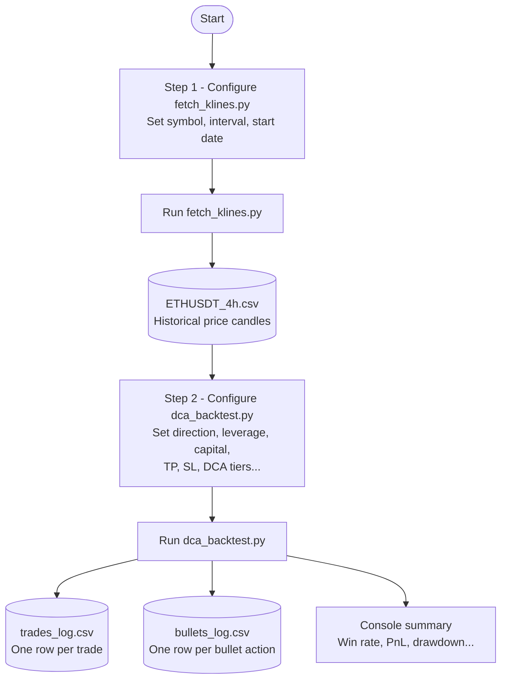
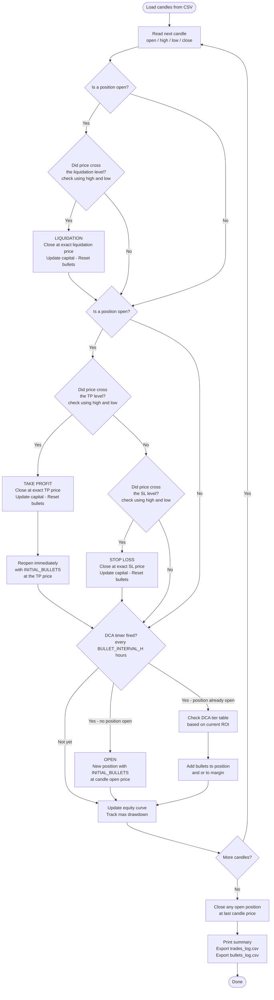

# DCA Backtester

Test a leveraged futures DCA trading strategy against real historical price data from Binance — **no real money, no live orders, purely for analysis**.

---

## What does it do?

The program downloads historical price data and then simulates a trading strategy where you:

1. Open a futures position with a small amount of capital
2. Automatically add more capital ("bullets") to the position over time based on how much it is winning or losing
3. Close the trade when it hits your profit target (TP) or loss limit (SL)
4. Reopen immediately and repeat

At the end it exports two spreadsheets with detailed results and prints a summary.

---

## How the whole program works



---

## How the simulation logic works (per candle)



---

## Installation (for first-time users)

### 1 — Install Python

Go to **[python.org/downloads](https://www.python.org/downloads/)** and download the latest version for your operating system.

> **Windows users:** During installation, tick the checkbox **"Add Python to PATH"** before clicking Install. If you miss this, Python will not work from the terminal.

To verify Python is installed, open a terminal and run:
```
python --version
```
You should see something like `Python 3.12.0`.

---

### 2 — Open a terminal in the project folder

**Windows:**
1. Open File Explorer and navigate to the folder where you saved this project
2. Click the address bar at the top, type `cmd`, and press Enter

**Mac:**
1. Open Terminal (press `Cmd + Space`, type `Terminal`, press Enter)
2. Type `cd ` (with a space), then drag the project folder into the Terminal window, then press Enter

**Linux:**
1. Right-click inside the project folder and select "Open Terminal here"

---

### 3 — Install the required library

In the terminal, run this once:

```bash
pip install requests
```

---

## Step 1 — Download historical price data

Open `fetch_klines.py` in any text editor (Notepad, TextEdit, VS Code) and change the three settings at the top of the file:

```python
SYMBOL   = "ETHUSDT"    # the trading pair you want to download
INTERVAL = "4h"         # candle size: 1m 5m 15m 1h 4h 1d 1w
START_DATE = "2022-01-01"  # start date, or None for full history
```

| Setting | What it means | Common values |
|---|---|---|
| `SYMBOL` | Which coin pair to download | `"BTCUSDT"`, `"ETHUSDT"`, `"SOLUSDT"` |
| `INTERVAL` | How often a new price point is recorded | `"1h"` = hourly · `"4h"` = every 4 h · `"1d"` = daily |
| `START_DATE` | Where to start the download | `"2022-01-01"` or `None` for all available history |

Then run:

```bash
python fetch_klines.py
```

This creates a file like `ETHUSDT_4h.csv` in the same folder. This file is the price history the backtest will read.

---

## Step 2 — Run the backtest

Open `dca_backtest.py` and edit the settings at the top of the file.

### Trading settings

```python
DIRECTION         = "LONG"    # LONG = bet price goes up | SHORT = bet price goes down
LEVERAGE          = 5         # 5x leverage
TOTAL_CAPITAL     = 1000.0    # total USD you have to trade with
TOTAL_BULLETS     = 30        # how many pieces to split your capital into
INITIAL_BULLETS   = 2         # pieces used to open a new position
TP_PCT            = 20.0      # close the trade at +20% ROI on margin
SL_PCT            = 50.0      # close the trade at -50% ROI on margin (None = disabled)
BULLET_INTERVAL_H = 24        # check DCA every 24 hours
```

| Setting | Plain English |
|---|---|
| `DIRECTION` | `"LONG"` if you think the price will go up, `"SHORT"` if you think it will go down |
| `LEVERAGE` | Multiplier applied to your position. 5x means a 1% price move = 5% ROI on margin. Higher leverage = higher risk |
| `TOTAL_CAPITAL` | The total USD amount you are testing with |
| `TOTAL_BULLETS` | Your capital is split into this many equal pieces (bullets). More bullets = more DCA opportunities |
| `INITIAL_BULLETS` | How many bullets are used to open each new trade |
| `TP_PCT` | The ROI % at which the trade is closed as a win. This is ROI on margin, not price |
| `SL_PCT` | The ROI % at which the trade is closed as a loss. Set to `None` to disable the stop loss |
| `BULLET_INTERVAL_H` | How many hours between each DCA check. `24` = check once per day |

### Data settings

```python
PAIR       = "ETHUSDT"      # must match the CSV you downloaded in Step 1
INTERVAL   = "4h"           # must match the CSV you downloaded in Step 1
START_DATE = "2022-01-01"   # backtest start date
END_DATE   = "2024-01-01"   # backtest end date
```

> `PAIR` and `INTERVAL` must exactly match what you used in `fetch_klines.py`.

### DCA tier table

This controls how many bullets are added at each DCA check depending on how much the trade is currently losing. The table is read from top to bottom — the **first row whose threshold is met wins**.

```python
DCA_TIERS = [
    #  (minimum ROI%,   bullets to position,   bullets to margin)
    (  0.0,  1,  0),   # winning or flat      → add 1 bullet to position
    ( -5.0,  2,  0),   # losing  5% or more   → add 2 bullets to position
    (-10.0,  3,  0),   # losing 10% or more   → add 3 bullets to position
    (-15.0,  4,  0),   # losing 15% or more   → add 4 bullets to position
    (-20.0,  5,  0),   # losing 20% or more   → add 5 bullets to position
    (-40.0,  6,  0),   # losing 40% or more   → add 6 bullets to position
    (float("-inf"), 3, 3),  # losing very heavily → 3 to position + 3 to margin
]
```

- **Bullets to position** — increases the trade size and brings the average entry price closer to the current price (averaging down/up)
- **Bullets to margin** — adds collateral to push the liquidation price further away, **without** changing the trade size or average entry

Then run:

```bash
python dca_backtest.py
```

---

## Key concepts explained

**Bullet** — one unit of capital. If `TOTAL_CAPITAL = $1000` and `TOTAL_BULLETS = 30`, each bullet is worth ~$33.33. The bullet pool resets after every trade.

**ROI on margin** — the profit/loss percentage shown on futures exchanges, which includes the effect of leverage. Example: with 5x leverage, a 4% price move in your direction = 20% ROI on margin.

**DCA (Dollar Cost Averaging)** — adding more capital to a losing position to bring the average entry price closer to the current price, so a smaller recovery move is enough to reach the profit target.

**Liquidation** — if the position loses too much and the collateral runs out, the exchange forcibly closes it. The simulator checks for this on every single candle using the candle's high and low prices.

**Compounding** — profits from winning trades grow your total capital, making each bullet worth more. Losses shrink it. If capital reaches zero, the simulation stops.

---

## Output

### Console summary

```
==========================================
       BACKTEST RESULTS
==========================================
  Period      : 2022-01-01 to 2024-01-01
  Pair        : ETHUSDT 4h  |  LONG  |  5x
  Capital     : $1,000.00 -> $1,842.10  (30 bullets)
------------------------------------------
  Trades      : 87  (71 wins, 16 losses)
  Win rate    : 81.6%
  Total PnL   : +$842.10  (+84.2%)
  Max drawdown: $310.00  (31.0%)
  Avg ROI/trade: +9.70%
  Liquidations: 1
==========================================
```

### `trades_log.csv` — one row per completed trade

| Column | What it means |
|---|---|
| `trade_id` | Trade number (1, 2, 3 …) |
| `entry_time` / `exit_time` | When the trade opened and closed (UTC) |
| `direction` | `LONG` or `SHORT` |
| `avg_entry_price` | Average price paid across all DCA entries |
| `exit_price` | Price the trade was closed at |
| `bullets_used_position` | Total position bullets consumed |
| `bullets_used_margin` | Total margin-only bullets consumed |
| `total_margin_usd` | Total USD committed to this trade |
| `pnl_usd` | Profit or loss in USD |
| `roi_pct` | ROI on margin at close |
| `exit_reason` | `TP`, `SL`, `LIQUIDATION`, or `END_OF_PERIOD` |
| `capital_before` | Your total equity just before this trade |
| `capital_after` | Your total equity just after this trade |
| `duration_hours` | How long the trade lasted (in hours) |
| `bullet_value_at_open` | USD value of one bullet when the trade opened (shows compounding) |
| `price_change_pct` | Raw unleveraged price move from entry to exit |
| `capital_pct_risked` | What percentage of your equity was deployed in this trade |

### `bullets_log.csv` — one row per bullet action

| Column | What it means |
|---|---|
| `timestamp` | When the action happened (UTC) |
| `price` | Price at the time of the action |
| `action` | `OPEN`, `DCA_POSITION`, or `DCA_MARGIN` |
| `bullets_count` | How many bullets were added in this action |
| `pos_avg_entry` | Average entry price after this action |
| `roi_pct` | ROI on margin at the time of this action |
| `liquidation_price` | Liquidation price after this action |
| `bullets_remaining` | Position bullets left in the pool |

---

## Notes

- All ROI percentages are **ROI on margin** (leverage-amplified) — this matches what exchanges display
- TP and SL are checked on **every candle** using the candle high/low, so they trigger at the exact target price (no overshoot)
- DCA is checked every `BULLET_INTERVAL_H` hours regardless of candle size
- Liquidation uses a simplified isolated-margin formula with a 0.4% maintenance margin rate
- The bullet pool resets to full after every trade cycle, using the updated capital
- CSV data files are excluded from the repo — re-generate them with `fetch_klines.py`
